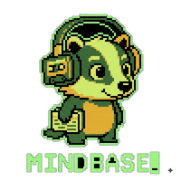

<p align="center">
  
</p>

<h1 align="center">Mindbase</h1>

<p align="center">
  Desktop app and CLI for processing video/audio recordings: transcribe, summarize, and push results to Slack or Confluence.
</p>

<p align="center">
  
  
  
  
</p>

<p align="center">
  <a href="http://www.youtube.com/watch?v=uupB2A7dG5k" title="mindbase demo">
    
  </a>
</p>

## Contents

- [Installation](#installation)
- [Configuration](#configuration)
- [Desktop app features](#desktop-app-features)
- [CLI (mindbase-tool)](#cli-mindbase-tool)
- [As a Python package](#as-a-python-package)
- [Local development](#local-development)
- [Audio processing scripts](#audio-processing-scripts)

## Installation

```bash
make install
```

This will:
1. Copy the package, scripts, and assets to `~/.local/share/mindbase/`
2. Create a Python venv and install all requirements
3. Copy env vars from repo `.env` (or prompt for `NEBIUS_API_KEY`) and save to `~/.local/share/mindbase/.env`
4. Create symlinks at `~/.local/bin/mindbase`, `~/.local/bin/mindbase-cli`, and `~/.local/bin/mindbase-tool`

> [!TIP]
> If `~/.local/bin` is not on your `$PATH`, the installer will print the line to add to `~/.zshrc`.

**Build and start the desktop app:**

```bash
make install
mindbase
```

`mindbase` prints the path to its log file (`~/.local/share/mindbase/workflow.log`) on startup.

**Start the terminal REPL:**

```bash
mindbase-cli
```

**Follow the app log:**

```bash
make follow
```

## Configuration

Copy `env.template` to `.env` and fill in the values you need:

```bash
cp env.template .env
```

See `env.template` for all supported variables. Key settings:

| Variable | Description |
|---|---|
| `MODEL_NAME` | LLM model name. Default: `Qwen/Qwen3-32B` (Nebius). Set to `gemini-2.5-flash` for Google Gemini |
| `NEBIUS_API_KEY` | API key for Nebius AI Studio |
| `GOOGLE_API_KEY` | API key for Google Gemini |
| `GOOGLE_APPLICATION_CREDENTIALS` | Path to service account JSON for Vertex AI (alternative to API key) |
| `SLACK_WEBHOOK_URL` | Incoming Webhook URL (takes priority over bot token) |
| `SLACK_BOT_TOKEN` / `SLACK_CHANNEL` | Bot token + channel for Slack Web API |
| `CONFLUENCE_*` | Confluence base URL, email, token, and parent page URL (space key is extracted automatically) |
| `SUPERHUMAN_API_TOKEN` | API token for Coda / Superhuman (from coda.io/account) |
| `SUPERHUMAN_PARENT_DIR` | Coda folder URL or ID (e.g. `fl-...`) to create docs in |

> [!NOTE]
> All settings can also be configured from the **Settings** tab in the desktop app.

## Desktop app features

| | |
|---|---|
| 💬 **Chat** | Conversational interface with file search, PDF conversion, YouTube download, video summarization |
| 🔀 **Workflow** | Configurable pipeline with toggleable steps — transcribe, summarize, and deliver |

**Workflow pipeline steps:**

- Transcribe video/audio to SRT (`mlx-whisper`, Apple Silicon)
- Summarize transcript with LLM (with token counting and caching)
- Post summary to Slack (webhook or bot)
- Create Confluence page
- Push to Superhuman (Coda)

**Also:**

- Accepts video (`.mp4`, `.mov`, `.webm`), audio (`.m4a`, `.mp3`), and text files (`.txt`, `.md`, `.srt`)
- Real-time progress display with download progress bars
- LLM provider routing: Nebius or Google Gemini (API key or Vertex AI credentials)

## CLI (mindbase-tool)

Non-interactive, scriptable entry point — one command in, artifacts out. Unlike `mindbase-cli`
(chat REPL) and `mindbase` (desktop app), `mindbase-tool` takes flags and exits, so it's suited
for shell scripts and cron jobs.

**Summarize a recording (transcribe → summarize → translate):**

```bash
mindbase-tool summarize --input "Daily standup - 2026_08_20.mp4" --lang ru
```

Runs the full pipeline and moves the results into a directory named after the input file:
- `<stem>.srt` — transcript
- `<stem>_summary.md` — summary in the spoken language
- `<stem>_summary_en.md` — English translation (only if `--lang` isn't `en`)

Steps are skipped if their output already exists, so re-running only fills in what's missing.
Accepts a local video/audio file or a YouTube URL.

**Extract subtitles only:**

```bash
mindbase-tool transcribe --input recording.mp4 --lang en
```

**Translate an existing file to English:**

```bash
mindbase-tool translate --input recording_summary.md
```

Accepts `.md`, `.txt`, or `.srt` input; writes `<stem>_en.md` next to it.

## As a Python package

Install `mindbase_layer` into an external project:

```bash
uv add "mindbase-layer @ git+https://github.com/aleksandr-dzhumurat/mindbase_layer.git"

# with local Apple Silicon transcription
uv add "mindbase-layer[whisper] @ git+https://github.com/aleksandr-dzhumurat/mindbase_layer.git"
```

## Local development

```bash
uv venv
source .venv/bin/activate
uv pip install -e ".[whisper]"
```

**Upgrade after code changes:**

```bash
make install              # keeps the existing venv and .env
make cli-install-fresh    # also rebuilds the venv from scratch (force)
```

## Audio processing scripts

> [!NOTE]
> Requires `ffmpeg` (`brew install ffmpeg` on macOS).

```bash
python scripts/process_media.py extract ~/Downloads/recording.mp4      # extract audio → .mp3
python scripts/process_media.py compress ~/Downloads/recording.mp4     # compress video → smaller .mp4
python scripts/audio_splitter.py ~/Downloads/recording.mp3             # split at silence → chunks
python scripts/whisper_to_srt.py ~/Downloads/chunk_01.mp3              # transcribe → .srt
python scripts/text_merger.py --prefix chunk                            # merge text files
```
